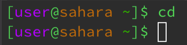
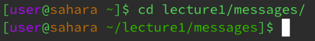
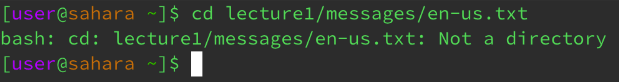
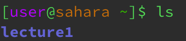
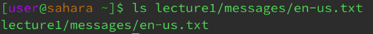
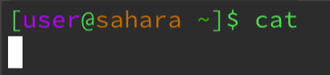
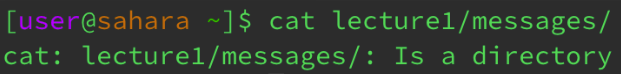
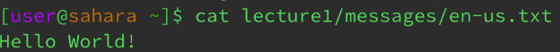

# Lab Report 1
## cd

Working Directory: /home
I got a blank output when entering cd with no argument because I did not specify a directory to change into, and so it remains in the current working directory of /home. The output is not an error.

Working Directory before command was run: /home 
Working Directory after command was run: /home/lecture1/messages
When I entered cd with the argument as the path to the directory “lecture1/messages/”, the current working directory changed from /home to /home/lecture1/messages since I specified what directory to change into. This output is not an error.

Working Directory: /home
When I entered cd with the argument as the path to the file “lecture1/messages/en-us.txt”, a message was printed in the terminal indicating that the file specified was not a directory and therefore the working directory could not be changed to it. This output is an error, since when using the cd command, you need to include a path to a directory as the argument rather than a file, as the command cannot change the current working directory to a specific file; it must also be a directory in order to be switched into.

## ls

Working Directory: /home
Entering no argument after ls produces the output of all the directories and files contained within the current working directory, which in this case, is the lecture 1 directory. The output being bold and colored blue distinguishes directories from individual files, which are in the default text format. This output is not an error. 

Working Directory: /home
Entering the path to a specific directory as an argument after ls produces the output listing all the files and directories contained within the specified directory, which in this case is all the .txt files inside of the messages directory. This output is not an error.

Working Directory: /home
Entering an argument with the path to a file after ls produces the output of the same path to the file specified in the argument, since files do not contain other files or directories that can be listed as part of the output. This output is not an error.

## cat

Working Directory: /home
Entering no argument after cat produces a blank output, unless the user types something after pressing enter the first time. The output is not an error, since when there is no path argument after the user first presses enter, the command cat is intended to print what the user types in after that point back into the terminal when enter is pressed again. This cycle can be exited by entering Ctrl + C.

Working Directory: /home
Entering the path to a directory as an argument after cat produces the output of a message stating that the path specified is to a directory, meaning the cat command cannot print its contents. This output is an error, since directories do not contain text or other concatenable contents found in files, but rather only contain files or other directories within them.

Working Directory: /home
Entering the path to a file as an argument after cat produces the output of the contents of the specified file printed to the terminal, as this is an intended function of the cat command. This output is not an error.

