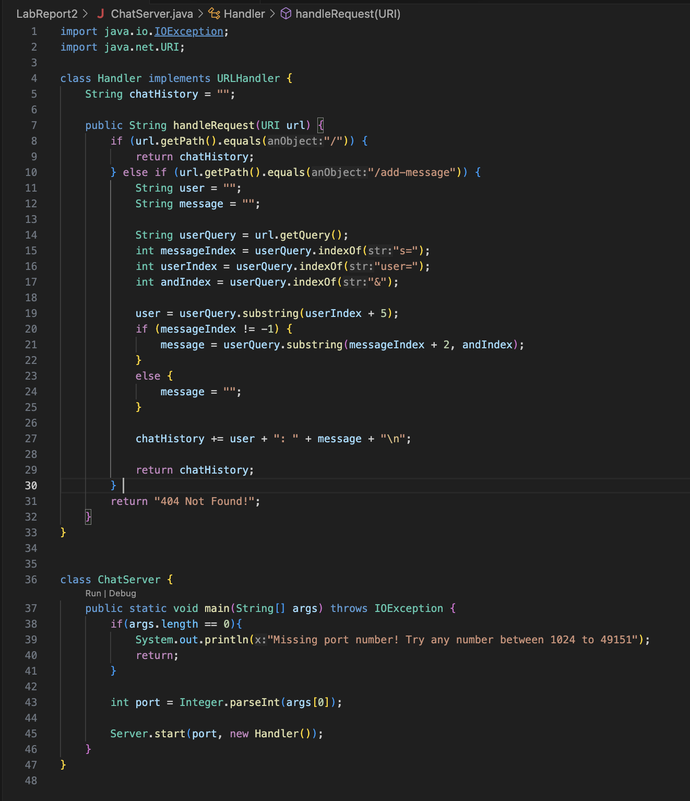
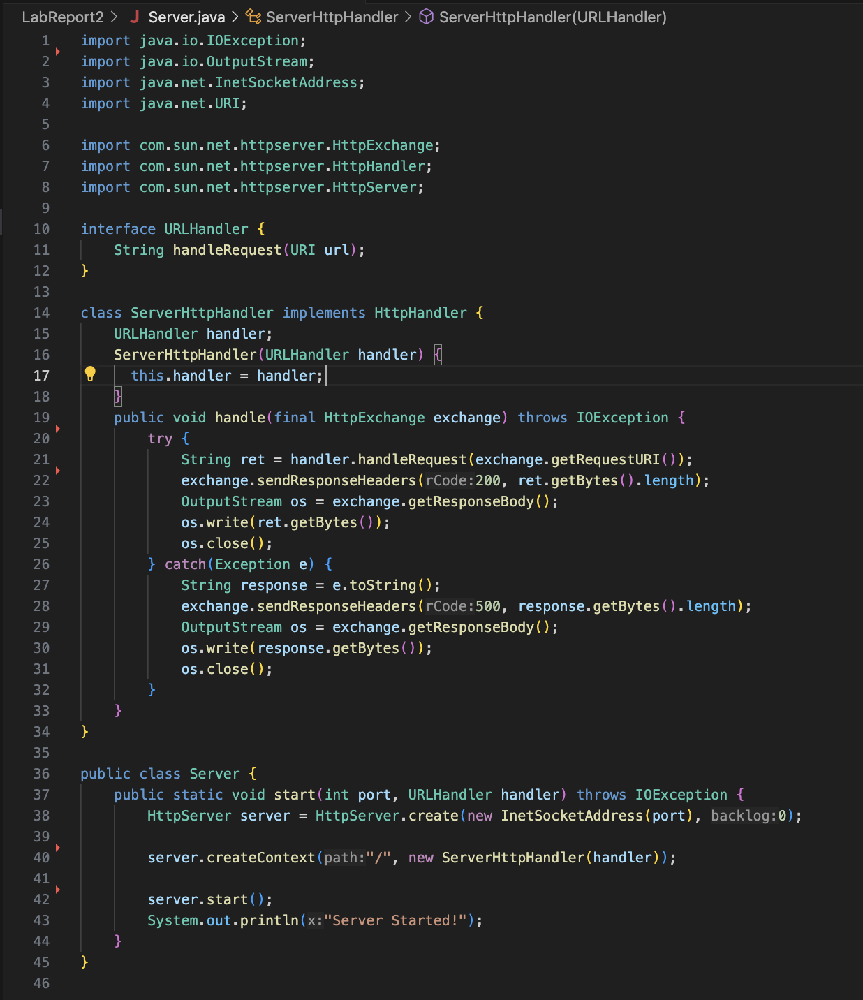
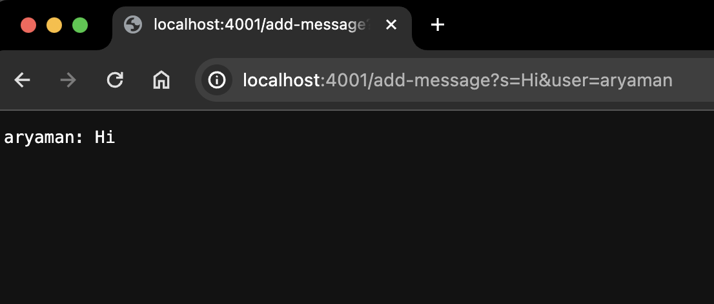
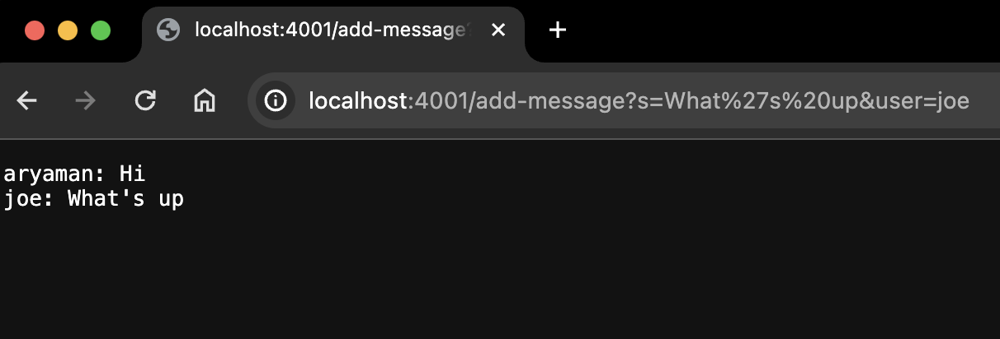
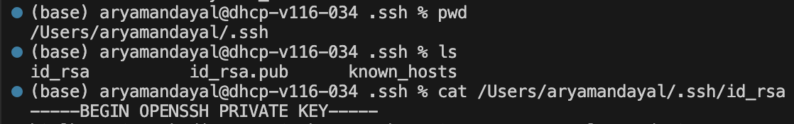
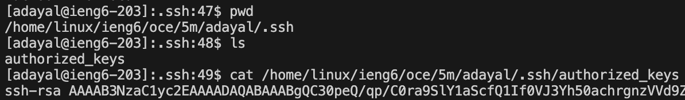
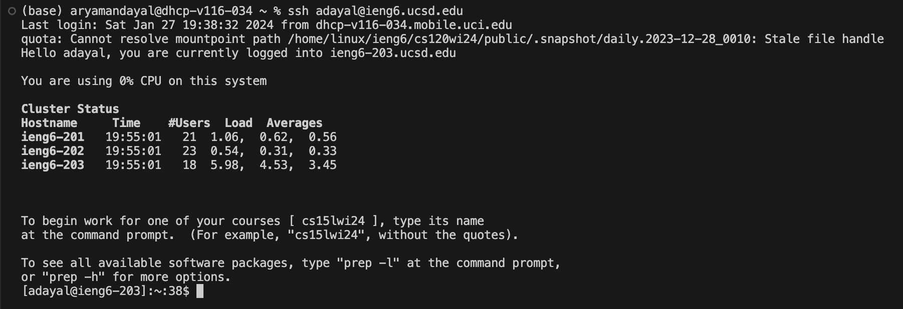

# Lab Report 2

## Part 1

## ChatServer.java Code

## Server.java Code

# Using /add-message

The method `handleRequest(URI url)` is called by the main method. The argument provided to this method is `URI url` the URL entered into their browser, which in this case is `http://localhost:4001/add-message?s=Hi&user=aryaman`. In the overarching Handler class, the field `String chatHistory` initially establishes the chat history to be displayed later as an empty string, since no user or message has been identified at this point. Next, within the `handleRequest(URI url)` method, the fields `String user` and `String message` are initialized to empty strings, then later updated with the name of the user and their chat message respectively determined from the url path. Then, `String userQuery` represents the user's custom query after the "?" in the url, which in this case is `s=Hi&user=aryaman`. Using `userQuery`, `int messageIndex`, `int userIndex`, and `int andIndex` are updated with the index positions of "s=", "user=", and "&" in order to splice the corresponding substrings of `userQuery` after "s=" indicating the message and "user=" indicating the user's name to be assigned to `message` and `user`, which are lastly concatenated and appended to the currently empty `chatHistory` to display "aryaman: Hi" on the webpage after `chatHistory` is returned.

The method `handleRequest(URI url)` is called by the main method. The argument provided to this method is `URI url` the URL entered into their browser, which in this case is `http://localhost:4001/add-message?s=What%27s%20up&user=joe`. In the overarching Handler class, the field `String chatHistory` currently stores the string displayed on the webpage from the previous call of the `handleRequest(URI url)` method, "aryaman: Hi". Next, within the `handleRequest(URI url)` method, the fields `String user` and `String message` are initialized to empty strings, then later updated with the name of the user and their chat message respectively determined from the url path. Then, `String userQuery` represents the user's custom query after the "?" in the url, which in this case is `s=What%27s%20up&user=joe`. Using `userQuery`, `int messageIndex`, `int userIndex`, and `int andIndex` are updated with the index positions of "s=", "user=", and "&" in order to splice the corresponding substrings of `userQuery` after "s=" indicating the message and "user=" indicating the user's name to be assigned to `message` and `user`, which are lastly concatenated and appended to the currently empty `chatHistory` to display "aryaman: Hi" on the first line and "joe: What's up" on the second line of the webpage after `chatHistory` is returned.

## Part 2

# Absolute Path to Private Key

# Absolute Path to Public Key

# Logging into `ieng6` Account without Password

# Part 3

# What I Learned

Something new I learned from week 2 and 3 is how to create a web server using Java. I learned about how the starter code works, the working range for localhost port numbers, and manipulating what is displayed on the page based on varying paths and queries in the webpage's url. I also learned about how to configure `ssh` for logins to not require a password.
