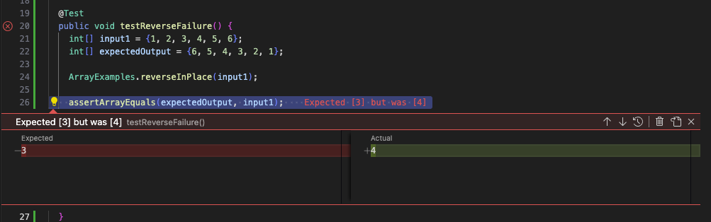
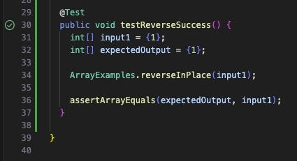

# Lab Report 3
## Part 1

Failure Inducing JUnit Test:
```
@Test
  public void testReverseFailure() {
    int[] input1 = {1, 2, 3, 4, 5, 6};
    int[] expectedOutput = {6, 5, 4, 3, 2, 1};

    ArrayExamples.reverseInPlace(input1);

    assertArrayEquals(expectedOutput, input1);
  }
```
Non-Failure Inducing JUnit Test:
```
@Test
  public void testReverseSuccess() {
    int[] input1 = {1};
    int[] expectedOutput = {1};

    ArrayExamples.reverseInPlace(input1);

    assertArrayEquals(expectedOutput, input1);
  }
```
Running the two tests:






Code Before Fix:

```
static void reverseInPlace(int[] arr) {
    for(int i = 0; i < arr.length; i += 1) {
      int[] tempArr;
      arr[i] = arr[arr.length - i - 1];
    }
  }
```

Code After Fix:

```
static void reverseInPlace(int[] arr) {
    for(int i = 0; i < arr.length / 2; i += 1) {
      int arr2 = arr[i];
      arr[i] = arr[arr.length - i - 1];
      arr[arr.length - i - 1] = arr2;
    }
  }
```

This fix addresses the issue because by iterating only to the halfway point of the array, hence the `i < arr.length / 2` condition in the `for` loop, thus ensuring that the method doesn't undo its previous work of swapping positions after this halfway point. Next, the `temp` variable to store the value at a position previously while that position is given the new reversed value is necessary in order to replace that old value in its new position, otherwise it would be overwritten without its value able to be recalled to be repositioned to its reversed position later, which was the issue with the original method before the fix.

## Part 2
1) `-i`

`grep -i "METHODNAME" ./technical/Server.java`

`grep -i "error" ./technical/test.txt`

2) `-l`
`grep -l "methodName" ./technical/server`

`grep -l "void" ./technical/main`

3) `-r`

`grep -r "methodName" ./technical`

`grep -r "void" ./technical`

4) `-v`

`grep -v "for" ./technical/Server.java`

`grep -v "assertTrue" ./technical/ServerTester.java`


