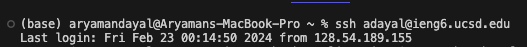
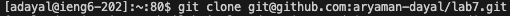
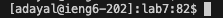
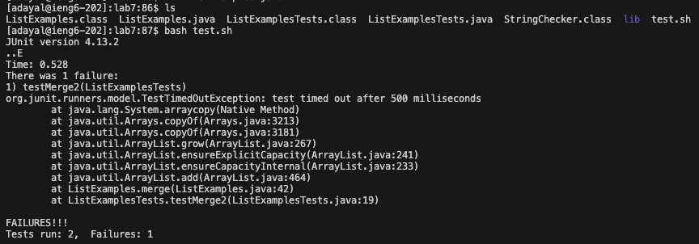
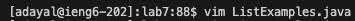
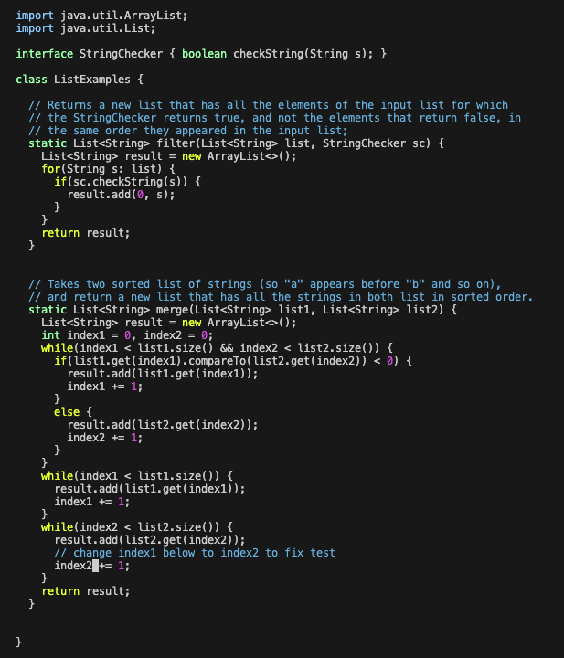

# Lab Report 4
## Step 4
I typed in the command `ssh adayal@ieng6.ucsd.edu` into the terminal then pressed `<enter>`. This allowed me to log into `ieng6` as described by the step.

## Step 5
I typed in the command `git clone git@github.com:aryaman-dayal/lab7.git` , pressed `<enter>`, then typed in `cd lab7` and pressed `<enter>` to change my current working directory to `lab7`. This was done in order to clone my forked Lab7 repository whilst logged into `ieng6`.

## Step 6
I typed in the command `ls` to see a list of the file names in the current working directory of `lab7` in order to find the name of the `.sh` file I needed to run in order to run the necessary tests on the files. I then typed `bash test.sh` to run the bash script that runs the needed tests, and saw that one test failed.

## Step 7
I typed in `vim L` then pressed `<tab>` in order to autofill the file name `ListExamples` and typed in the remaining `.java`. I then pressed `<down>` arrow 18 times, then `<right>` arrow one time in order to navigate me to the correct character location in the correct line needed to fix the bug in `ListExamples.java`. In then pressed `i` then `<backspace>` then `2`, thus replacing the `1` in the `index1` part of the line with `2`, thus fixing the issue causing the test ran earlier to fail. I then press `<esc>` then type `:wq` and press `<enter>` to write my changes to the file and save it, then quit the vim editor. 

## Step 8
I typed in `bash test.sh` then press `<enter>` to run the necessary tests again, and since I edited and saved the file with the issue causing the tests to fail initially, the tests now all pass.

## Step 9
I typed in `git add .` and pressed `<enter>`, then `git commit -m "TestMessage` and pressed `<enter>`, then `git push` and pressed `<enter>`. This was done in order to be able to commit and push the resulting changes I made to the fork of Lab7 on my GitHub account straight from the command line. 

